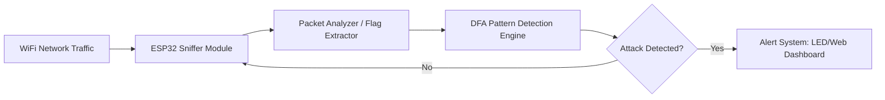
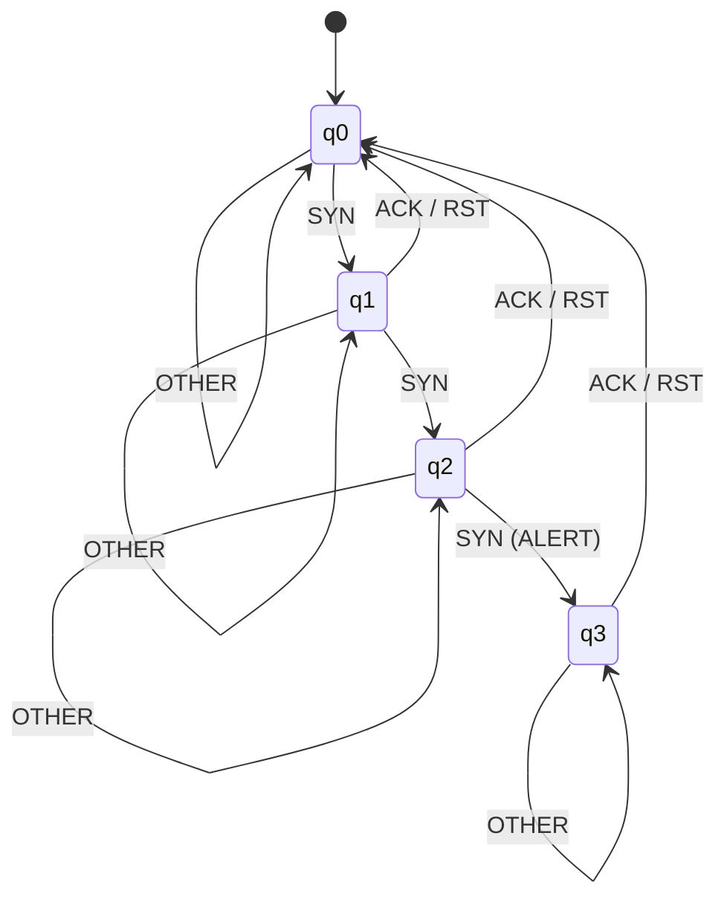

# Project Report: Network Packet Pattern Detector using Deterministic Finite Automata (DFA) on ESP32

## 1. Abstract
The "Network Packet Pattern Detector" project aims to design and implement a real-time intrusion detection system (IDS) on the ESP32 microcontroller. Network attacks, such as the SYN flood attack, pose significant threats by overwhelming network resources through rapid, incomplete connection requests. This project leverages Deterministic Finite Automata (DFA) to monitor and analyze incoming packet flags. By modeling packet sequences as transitions within a DFA, the system can efficiently detect suspicious patterns indicative of an attack. The ESP32's WiFi promiscuous mode is utilized for non-intrusive packet sniffing, making it an ideal, low-cost solution for real-time network monitoring and alert generation in IoT environments.

## 2. Introduction
In the modern era of interconnected devices, network security is paramount. Packet monitoring is a critical component of security, allowing for the detection of abnormal sequences that signify unauthorized access or denial-of-service (DoS) attempts. Conventional systems often require high computational power; however, Automata Theory provides a mathematical framework for efficient pattern matching. A Deterministic Finite Automaton (DFA) can process packet streams in constant time, making it suitable for resource-constrained hardware like the ESP32. This project demonstrates how theoretical models of computation can be applied to build robust, real-time Intrusion Detection Systems.

## 3. Problem Statement
Detecting suspicious packet patterns (like an excessive number of synchronization requests without completion) is a manual and computationally expensive task if not automated. There is a need for a lightweight, real-time system capable of sniffing network traffic, extracting metadata, and identifying malicious patterns without relying on heavy backend servers.

## 4. Objectives
*   **Packet Sniffing**: Implement WiFi promiscuous mode on ESP32 to capture packets.
*   **Metadata Extraction**: Extract TCP/IP flags (SYN, ACK, FIN, RST) from captured packets.
*   **Automata Implementation**: Design and implement a DFA-based pattern detection engine.
*   **Attack Detection**: Specifically identify SYN flood patterns (repeated SYNs without ACKs).
*   **Alert Generation**: Trigger visual (LED) and dashboard alerts upon detection.

## 5. System Architecture
The system follows a standalone sniffer architecture:
1.  **WiFi Network**: The medium through which packets are transmitted.
2.  **ESP32 Sniffer**: Operates in promiscuous mode to capture raw packets.
3.  **Packet Analyzer**: Parses the TCP/IP stack to identify packet types.
4.  **DFA Detection Engine**: Processes the sequence of flags through a state machine.
5.  **Web Dashboard**: Displays results on the laptop via high-speed Serial communication.

### Architecture Diagram


## 6. DFA Model Design
To detect a SYN flood (defined here as 3 consecutive SYN packets from the same source without an intermediate ACK/RST), we define the following DFA:

*   **States**:
    *   `q0`: Idle / Normal (Start State)
    *   `q1`: First SYN received
    *   `q2`: Second consecutive SYN received
    *   `q3`: SYN Flood Detected (Accept State)
*   **Input Alphabet (Σ)**: {`SYN`, `ACK`, `RST`, `OTHER`}
*   **Start State**: `q0`
*   **Accept State**: `q3`

### Transition Table
| Current State | Input: SYN | Input: ACK | Input: RST | Input: OTHER |
| :--- | :--- | :--- | :--- | :--- |
| **q0** | q1 | q0 | q0 | q0 |
| **q1** | q2 | q0 | q0 | q1 |
| **q2** | q3 | q0 | q0 | q2 |
| **q3 (ALARM)** | q3 | q0 | q0 | q3 |

### DFA Transition Diagram


## 7. Methodology / Working
1.  **Packet Capture**: The ESP32 is placed in `promiscuous mode`. It scans the air for WiFi frames.
2.  **Flag Extraction**: The system filters for TCP packets and checks the 13th byte of the TCP header to extract flags.
3.  **State Transition**: Each extracted flag acts as an input to the DFA.
4.  **Attack Detection**: If the DFA reaches state `q3`, a SYN flood attack is flagged.
5.  **Alert Generation**: The ESP32 glows the LED and prints "SUSPICIOUS ACTIVITY: SYN FLOOD" to the terminal.

## 8. Hardware Requirements
*   **ESP32 Development Board**: The core microcontroller with WiFi capabilities.
*   **LED**: For visual alert indication.
*   **220 Ohm Resistor**: To protect the LED.
*   **Micro-USB Cable**: For programming and power.
*   **Breadboard & Jumper Wires**: For circuit assembly.

## 9. Software Requirements
*   **Arduino IDE**: For writing and uploading C++ code.
*   **Espressif ESP32 Board Manager**: To enable ESP32 support in Arduino IDE.
*   **C / C++ Language**: Used for efficient low-level processing.
*   **WiFi.h Library**: For managing WiFi connectivity and promiscuous mode.

## 10. Algorithm (SYN Flood Detection)
```plaintext
Algorithm: DFA_Packet_Detector
Input: Stream of Packet Flags (P)
Output: Alert status

1. Initialize current_state = q0
2. For each packet p in P:
    a. Extract flag (f) from p
    b. if (f == SYN):
           if current_state == q0 then current_state = q1
           else if current_state == q1 then current_state = q2
           else if current_state == q2 then current_state = q3 (ALERT)
    c. else if (f == ACK OR f == RST):
           current_state = q0 (Reset to normal)
    d. else:
           remain in current_state
3. End For
```

## 11. Expected Output
**Serial Monitor Simulation:**
```text
[INFO] Starting Sniffer...
[SNIFF] Packet Captures: TCP [Flags: SYN] -> State: q1
[SNIFF] Packet Captures: TCP [Flags: SYN] -> State: q2
[ALERT] SUSPICIOUS PATTERN DETECTED: THREE CONSECUTIVE SYN PACKETS! -> State: q3
[INFO] LED STATUS: HIGH
[SNIFF] Packet Captures: TCP [Flags: ACK] -> State: q0 (Reset)
```

## 12. Applications
*   **IoT Security**: Protecting smart home devices from DoS attacks.
*   **Network Monitoring**: Low-cost portable security probes for network admins.
*   **Intrusion Detection Systems (IDS)**: Integrated as a front-line defense in edge computing.

## 13. Advantages
*   **High Efficiency**: DFA transitions are $O(1)$ per packet, ensuring real-time performance.
*   **Low Cost**: implemented using a standard ESP32 ($< \$5).
*   **Mathematical Formality**: Automata theory ensures the system's behavior is predictable and verifiable.

## 14. Future Enhancements
*   **Multi-Pattern Detection**: Using Non-deterministic Finite Automata (NFA) to detect multiple types of attacks simultaneously.
*   **Web Dashboard**: Exporting logs to a real-time web UI using WebSockets.
*   **Machine Learning**: Dynamically updating DFA transition thresholds based on traffic history.

## 15. Conclusion
This project successfully demonstrates the application of Automata Theory in the domain of Cybersecurity. By implementing a DFA-based pattern detector on an ESP32, we provide a lightweight and effective method for identifying SYN flood attacks. The project bridges the gap between theoretical computer science and hardware implementation, proving that efficient security solutions can be achieved on low-power devices.
